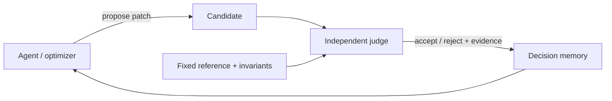

<style>
@import "../../styles/theme.css";
</style>

# 先建立一条**不会自欺**的研究闭环

PTO executable architecture spec → 课程 NDF 投影 → pyCircuit 行动空间 → 可审计证据

<div class="visual-frame" style="margin-top:3rem;padding:2rem">
  <div class="flow">
    <span class="flow-node">规范事实</span><span class="flow-arrow">→</span>
    <span class="flow-node">设计承诺</span><span class="flow-arrow">→</span>
    <span class="flow-node">可执行变体</span><span class="flow-arrow">→</span>
    <span class="flow-node">独立裁判</span>
  </div>
</div>

<p class="muted" style="margin-top:1.5rem">第一课 · 60 分钟 · 面向体系结构研究者与研究生</p>

<!--
NDF-ID: NDF-MTH-001, NDF-SRC-001
Learning objective: 建立本课的研究闭环与证据优先心智模型。
Duration: 1 min
Visual intent: class: hero；用四节点闭环代替传统“目录页”。
Evidence: docs/NDF.md; materials/SOURCES.yaml
Interaction: 请听众记住一个词：裁判。
Caveat: 本课讲研究方法，不把任何案例实现冒充 PTO 规范。
[Sources]
- docs/GOAL_PROMPT.md
- materials/SOURCES.yaml
-->

---

<style>
@import "../../styles/theme.css";
</style>

# Agent 放大的首先是**歧义**，不是生产力

当自然语言、代码、波形和性能数字彼此矛盾时，Agent 会更快地产生更多“看似合理”的版本。

<div class="split" style="height:270px">
  <div>
    <h2>传统风险</h2>
    <p>一个人误解一个接口。</p>
    <p>错误传播速度有限。</p>
  </div>
  <div class="visual-frame" style="padding:1.6rem">
    <h2>Agent 时代风险</h2>
    <div class="flow">
      <span class="flow-node">模糊主张</span><span class="flow-arrow">×</span>
      <span class="flow-node">高吞吐修改</span><span class="flow-arrow">=</span>
      <span class="flow-node">系统性漂移</span>
    </div>
  </div>
</div>

> 第一原则：先让主张可判定，再让 Agent 可行动。

<!--
NDF-ID: NDF-MTH-002, NDF-MTH-003
Learning objective: 解释为何 Agent 需要比人工流程更强的主张分类与独立裁判。
Duration: 1.5 min
Visual intent: class: compare；左右对比风险传播速度。
Evidence: experiments/artifacts/07/expected_failure.json
Interaction: 举手投票：你最近一次返工源于“写错”还是“理解错”？
Caveat: Agent 不是错误的唯一来源；它改变的是扩散速度与规模。
[Sources]
- docs/NDF.md
- experiments/tests/test_smoke.py
-->

---

<style>
@import "../../styles/theme.css";
</style>

# 今天只练**四个判断动作**

1. 判断一条话属于规范、实现、观察还是假设。
2. 把规范条款投影成可追踪的 NDF 设计承诺。
3. 在 pyCircuit 中定义有限、合法、可回滚的动作。
4. 用独立证据决定接受、拒绝或继续探索。

<div class="visual-frame" style="padding:1.25rem 2rem;margin-top:1.5rem">
  <div class="flow">
    <span class="flow-node">分类</span><span class="flow-arrow">→</span>
    <span class="flow-node">投影</span><span class="flow-arrow">→</span>
    <span class="flow-node">行动</span><span class="flow-arrow">→</span>
    <span class="flow-node">裁决</span>
  </div>
</div>

<!--
NDF-ID: NDF-LRN-101, NDF-LRN-102
Learning objective: 说明本课结束时可观察、可检验的学习结果。
Duration: 2 min
Visual intent: class: architecture；四个动词构成学习路径。
Evidence: docs/NDF.md
Interaction: 邀请听众选一个最不熟悉的动作，课末回看。
Caveat: 第一课不会完整展开 PPA 优化和 Pareto 搜索；第二课继续。
[Sources]
- docs/NDF.md
-->

---

<style>
@import "../../styles/theme.css";
</style>

# 一项研究只有闭环，才配得上“可复现”

<div class="visual-frame" style="padding:1.2rem">
  <div class="flow">
    <span class="flow-node">PTO 规范</span><span class="flow-arrow">→</span>
    <span class="flow-node">NDF</span><span class="flow-arrow">→</span>
    <span class="flow-node">微架构</span><span class="flow-arrow">→</span>
    <span class="flow-node">验证 / trace</span><span class="flow-arrow">→</span>
    <span class="flow-node">测量</span><span class="flow-arrow">→</span>
    <span class="flow-node">Agent</span><span class="flow-arrow">→</span>
    <span class="flow-node">决策写回</span>
  </div>
</div>

<div style="display:grid;grid-template-columns:1fr 1fr;gap:2rem;margin-top:1.5rem">
  <blockquote>前半环回答：<strong>什么不能变？</strong></blockquote>
  <blockquote>后半环回答：<strong>什么值得变？</strong></blockquote>
</div>

<!--
NDF-ID: NDF-MTH-001
Learning objective: 能复述“规范→NDF→微架构→验证→测量→Agent→决策”的完整闭环。
Duration: 3 min
Visual intent: class: architecture；展示课程的单一总图，并强调决策写回。
Evidence: docs/NDF.md; experiments/artifacts/summary.json
Interaction: 顺时针点读闭环；让听众指出“写代码”位于哪一段。
Caveat: 环中每个箭头都需要明确输入输出；图本身不是证据。
[Sources]
- docs/NDF.md
- docs/GOAL_PROMPT.md
-->

---

<style>
@import "../../styles/theme.css";
</style>

# 先给每句话贴上**证据类型**，争论会立刻变短

| 类型 | 典型句式 | 谁能推翻它 |
|---|---|---|
| 规范事实 | “实现 **MUST** 保持……” | 固定版本规范 |
| 实现事实 | “当前模块把状态放在……” | 当前源码 / elaboration |
| 实验观察 | “这个版本在该配置下……” | 同协议复现实验 |
| 研究假设 | “增加队列深度可能……” | 新实验或反例 |

<div class="visual-frame" style="padding:1rem 1.5rem;margin-top:1rem">
  <div class="flow"><span class="flow-node">句子</span><span class="flow-arrow">→</span><span class="flow-node">类型</span><span class="flow-arrow">→</span><span class="flow-node">裁判</span></div>
</div>

<!--
NDF-ID: NDF-MTH-003
Learning objective: 能把研究陈述分类，并为每一类指定可接受的反证来源。
Duration: 2 min
Visual intent: class: evidence；用“句子→类型→裁判”强化分类动作。
Evidence: docs/NDF.md
Interaction: 快问快答：“双发射少 3 个周期”属于哪一类？
Caveat: 同一句话可能混合多类主张，必要时拆句。
[Sources]
- docs/NDF.md
- materials/SOURCES.yaml
-->

---

<style>
@import "../../styles/theme.css";
</style>

# 可执行规范让语义进入**机器检查**

<div class="split">
  <div>
    <p>PTO executable architecture spec 在本课中承担唯一角色：提供固定版本的规范事实。</p>
    <div class="flow" style="justify-content:flex-start;margin-top:1rem">
      <span class="flow-node">输入：Tile / GlobalTensor</span><span class="flow-arrow">→</span>
      <span class="flow-node">转换：TLOAD / TADD</span><span class="flow-arrow">→</span>
      <span class="flow-node">结果：Tile / Memory</span>
    </div>
    <blockquote style="margin-top:1.2rem">固定提交：<code>PTO-ISA/pto-spec@9574f029…</code></blockquote>
  </div>
  
</div>

<!--
NDF-ID: NDF-SRC-001
Learning objective: 说明 executable architecture spec 在研究闭环中的责任边界。
Duration: 2.5 min
Visual intent: class: architecture；用输入—转换—结果的确定性标签配合本地 ImageGen 概念图，说明规范到实现的方向但不伪造精确连线。
Evidence: materials/SOURCES.yaml
Interaction: 请听众区分“操作结果”与“实现需要几个周期”。
Caveat: 本页不声称规范固定任何特定微架构、时延或资源绑定。
[Sources]
- https://github.com/PTO-ISA/pto-spec/tree/9574f0293929bf692517dd29de11a8354440c7dc
- materials/SOURCES.yaml
-->

---

<style>
@import "../../styles/theme.css";
</style>

# 五个操作就能形成第一条**端到端证据链**

```text
TALLOC  →  TLOAD A  →  TLOAD B  →  TADD  →  TSTORE
```

<div class="visual-frame" style="padding:1.2rem;margin-top:1rem">
  <div class="flow">
    <span class="flow-node">GM [1,2,3,4]</span><span class="flow-arrow">→</span>
    <span class="flow-node">Tile A + Tile B</span><span class="flow-arrow">→</span>
    <span class="flow-node">GM [11,22,33,44]</span>
  </div>
</div>

<p class="muted">这里展示的是操作序列，不是 PTO-AS 语法教程。</p>

<!--
NDF-ID: NDF-SRC-001, NDF-MTH-001
Learning objective: 用最小 PTO 操作链识别输入、状态变化与可观察输出。
Duration: 2.5 min
Visual intent: class: experiment；把实验 01 的操作序列与结果数组对齐。
Evidence: experiments/artifacts/01/pto_trace.json
Interaction: 逐步预测每个操作之后哪些值应当可见。
Caveat: 文本是教学用语义链，不宣称为可直接汇编的 PTO-AS 源码。
[Sources]
- experiments/tests/test_smoke.py
- https://github.com/PTO-ISA/pto-spec/tree/9574f0293929bf692517dd29de11a8354440c7dc
-->

---

<style>
@import "../../styles/theme.css";
</style>

# NDF 把研究承诺**钉在规范上**

<script setup lang="ts">
import NdfTraceability from '../../components/NdfTraceability.vue'
</script>

<NdfTraceability />

<p class="muted" style="margin-top:.55rem">NDF 提供结构、ID、关系和覆盖；它不替规范发明语义。</p>

<!--
NDF-ID: NDF-LRN-101, NDF-MTH-001
Learning objective: 解释 NDF 投影与原始规范之间的非替代关系。
Duration: 3 min
Visual intent: class: evidence；使用共享组件 NdfTraceability 展示条款、要求与验证的有向关系。
Evidence: experiments/artifacts/02/ndf_projection.json
Interaction: 点击或高亮一条链，口头读出“来源—承诺—裁判”。
Caveat: 课程 NDF 是教学投影，不属于 PTO 规范。
[Sources]
- docs/NDF.md
- experiments/artifacts/02/ndf_projection.json
- https://github.com/hengliao1972/normative_language/blob/main/normative_language.md
-->

---

<style>
@import "../../styles/theme.css";
</style>

# 好的追踪链必须允许你**反向找到责任人**

<div class="visual-frame" style="padding:1.3rem">
  <div class="flow">
    <span class="flow-node">NDF-LRN-102</span><span class="flow-arrow">→</span>
    <span class="flow-node">Slide 17</span><span class="flow-arrow">→</span>
    <span class="flow-node">TraceComparator</span><span class="flow-arrow">→</span>
    <span class="flow-node">Exp 04</span><span class="flow-arrow">→</span>
    <span class="flow-node">comparison.json</span>
  </div>
</div>

任何一个节点变化，都应该让追踪检查失败，而不是静默漂移。

<div style="display:grid;grid-template-columns:1fr 1fr;gap:1.5rem;margin-top:1.5rem">
  <blockquote><strong>正向：</strong>要求有没有被教、被演示、被验证？</blockquote>
  <blockquote><strong>反向：</strong>一个图、实验或数字为何存在？</blockquote>
</div>

<!--
NDF-ID: NDF-VIS-001, NDF-LRN-102
Learning objective: 能构造 requirement→slide→component→experiment→artifact 的双向追踪链。
Duration: 2.5 min
Visual intent: class: evidence；用一条真实课程链展示追踪粒度。
Evidence: docs/NDF.md; experiments/artifacts/04/comparison.json
Interaction: 隐去一个节点，让听众判断审计时最先出现什么告警。
Caveat: 文件存在不等于证据有效；还需检查 schema、版本和生成命令。
[Sources]
- docs/NDF.md
- scripts/check-content.mjs
-->

---

<style>
@import "../../styles/theme.css";
</style>

# 分层不是增加文档，而是限制每层**可以说什么**


| 层 | 合法问题 |
|---|---|
| L1 | 系统必须保持什么可观察行为？ |
| L2 | 哪种机制满足它？ |
| L3 | 当前实现与测试是否真的满足？ |

<!--
NDF-ID: NDF-LRN-101
Learning objective: 能把架构要求、微架构机制和实现证据放入正确层级。
Duration: 2 min
Visual intent: class: architecture；用 L0–L3 精炼链表现约束逐层收紧。
Evidence: experiments/artifacts/02/ndf_projection.json
Interaction: 给出“队列深度为 32”，请听众判断它通常位于哪一层。
Caveat: 层级编号是课程采用的投影方式，不宣称为 PTO 规范内部层级。
[Sources]
- https://github.com/hengliao1972/normative_language/blob/main/normative_language.md
- vendor/LinxCore/docs/spec/ndf.yaml
-->

---
background: /generated/modular-processor.png
class: imagegen-content
---

<style>
@import "../../styles/theme.css";
</style>

# LinxCore 是模块化案例，**不是 PTO 官方实现**

<div class="split">
  <div class="visual-frame" style="padding:1.5rem">
    <h2>本课借它观察</h2>
    <ul>
      <li>模块边界与状态所有权</li>
      <li>typed interface 与 backpressure</li>
      <li>trace、验证和替换证据</li>
    </ul>
  </div>
  <div>
    <h2>本课绝不声称</h2>
    <p>❌ LinxCore 定义 PTO 语义</p>
    <p>❌ LinxCore 是 PTO 参考实现</p>
    <p>❌ 案例参数等于规范要求</p>
  </div>
</div>

<!--
NDF-ID: NDF-SRC-003
Learning objective: 明确 PTO 规范事实源与 LinxCore 案例的边界。
Duration: 1 min
Visual intent: class: compare；用“可借用 / 不可声称”双栏建立边界。
Evidence: materials/SOURCES.yaml; docs/NDF.md
Interaction: 全班复述边界句：“案例提供机制，不提供 PTO 规范权威。”
Caveat: LinxCore 自身的 Linx 语义应由其 ISA 与稳定条款定义。
[Sources]
- materials/SOURCES.yaml
- https://github.com/LinxISA/LinxCore
-->

---

<style>
@import "../../styles/theme.css";
</style>

# 模块化的关键是**唯一状态所有者**

<script setup lang="ts">
import LinxCoreModuleExplorer from '../../components/LinxCoreModuleExplorer.vue'
</script>

<div style="transform:scale(.78);transform-origin:top left;width:128%;height:330px">
  <LinxCoreModuleExplorer />
</div>

<p class="muted">点击模块时，问的不是“它叫什么”，而是“它拥有什么状态、接受什么事务、输出什么证据”。</p>

<!--
NDF-ID: NDF-SRC-003, NDF-LRN-101
Learning objective: 用状态所有权而非文件目录解释模块边界。
Duration: 2 min
Visual intent: class: architecture；使用共享组件 LinxCoreModuleExplorer 逐模块查看处理路径。
Evidence: vendor/LinxCore/docs/spec/10-architecture/ownership.md
Interaction: 点击 OOO / BROB；让听众指出 commit 与 recovery 的唯一所有者。
Caveat: 组件是教学简化图；精确接口以固定版本源码和清单为准。
[Sources]
- vendor/LinxCore/docs/spec/00-charter/scope.md
- vendor/LinxCore/docs/spec/10-architecture/ownership.md
-->

---

<style>
@import "../../styles/theme.css";
</style>

# pyCircuit 把“改设计”压缩成**结构化行动空间**

<div class="visual-frame" style="padding:1.2rem">
  <div class="flow">
    <span class="flow-node">模块</span><span class="flow-node">端口</span>
    <span class="flow-node">CycleAwareSignal</span><span class="flow-node">队列</span>
    <span class="flow-node">参数</span><span class="flow-node">层次边界</span>
  </div>
</div>

Agent 不应“随便改 RTL”；它应从受约束动作中选择：

- 改参数，但保持接口 schema；
- 替换模块，但保持状态所有权；
- 调整流水深度，但保持架构观察等价；
- 新增 trace 点，但不让观察者阻塞提交。

<!--
NDF-ID: NDF-LRN-101, NDF-MTH-002
Learning objective: 把 pyCircuit 理解为可约束、可枚举的微架构行动空间。
Duration: 2.5 min
Visual intent: class: circuit-focus；以六类结构化对象代替自由文本修改。
Evidence: experiments/artifacts/03/pipeline_summary.json
Interaction: 请听众把一个“加深流水”的想法改写成参数、边界和不变量。
Caveat: pyCircuit 的 Python 包导入名是 `pycircuit`；行动空间仍需项目约束定义。
[Sources]
- https://github.com/LinxISA/pyCircuit
- /Users/zhoubot/Documents/janus_top_level_documents/pyCircuit_checkout/docs/PyCircuit_V5_Spec.md
-->

---

<style>
@import "../../styles/theme.css";
</style>

# 编译链不是后端细节，而是每次行动的**可审计路径**

<script setup lang="ts">
import PipelineStepper from '../../components/PipelineStepper.vue'
</script>

<PipelineStepper />

<div class="flow" style="margin-top:.8rem">
  <span class="flow-node">Python DSL</span><span class="flow-arrow">→</span>
  <span class="flow-node">Circuit IR / MLIR</span><span class="flow-arrow">→</span>
  <span class="flow-node">RTL</span><span class="flow-arrow">→</span>
  <span class="flow-node">测量</span>
</div>

<!--
NDF-ID: NDF-LRN-101, NDF-MTH-001
Learning objective: 识别一次 pyCircuit 修改在 Python、IR、RTL 和测量端的证据落点。
Duration: 2 min
Visual intent: class: circuit-focus；使用共享组件 PipelineStepper 演示逐级下降。
Evidence: experiments/artifacts/03/pipeline_summary.json
Interaction: Step/Play/Pause/Reset；每到一层说出应保存的工件。
Caveat: 组件展示通用课程链；具体后端命令与版本由项目环境固定。
[Sources]
- https://github.com/LinxISA/pyCircuit
- /Users/zhoubot/Documents/janus_top_level_documents/pyCircuit_checkout/docs/PyCircuit_V5_Spec.md
-->

---

<style>
@import "../../styles/theme.css";
</style>

# 队列把并发设计变成一个**局部可判定契约**

<script setup lang="ts">
import CircuitDataflow from '../../components/CircuitDataflow.vue'
</script>

<CircuitDataflow />

<!--
NDF-ID: NDF-LRN-102
Learning objective: 用 valid/ready/fire 定义局部传输与 backpressure 观察点。
Duration: 2 min
Visual intent: class: circuit-focus；使用共享组件 CircuitDataflow 动态追踪队列传输。
Evidence: experiments/artifacts/05/queue_summary.json
Interaction: Play 后暂停；指出 blocked 周期中必须保持稳定的 payload。
Caveat: 并非所有项目接口都采用同一命名，但传输条件必须可判定。
[Sources]
- experiments/tests/test_smoke.py
- vendor/LinxCore/docs/spec/20-behavior/ifu.md
-->

---

<style>
@import "../../styles/theme.css";
</style>

# 观察点应贴近**架构承诺**，而不是贴满内部信号

<div style="display:grid;grid-template-columns:1fr 1fr;gap:1.5rem">
  <div class="visual-frame" style="padding:1.3rem">
    <h2>优先观察</h2>
    <p>接受 / 拒绝、提交、异常、恢复、内存副作用</p>
  </div>
  <div class="visual-frame" style="padding:1.3rem">
    <h2>谨慎观察</h2>
    <p>私有队列索引、临时 tag、实现特定 stage 名称</p>
  </div>
</div>

<div class="flow" style="margin-top:1.5rem">
  <span class="flow-node">输入事务</span><span class="flow-arrow">→</span>
  <span class="flow-node">架构事件</span><span class="flow-arrow">→</span>
  <span class="flow-node">最终状态</span>
</div>

<!--
NDF-ID: NDF-LRN-102, NDF-MTH-003
Learning objective: 为流水线变体选择跨实现稳定的架构观察点。
Duration: 2 min
Visual intent: class: evidence；比较架构观察点与易漂移内部信号。
Evidence: experiments/artifacts/04/comparison.json
Interaction: 给出 `iq_head=7` 与 `commit pc=...`，让听众选择等价判据。
Caveat: 内部信号对调试仍有价值，但不应默认成为跨实现等价定义。
[Sources]
- vendor/LinxCore/docs/trace/linxtrace_v1.md
- vendor/LinxCore/docs/spec/50-verification/contract-spine.md
-->

---

<style>
@import "../../styles/theme.css";
</style>

# 等价允许时序不同，但**承诺必须一致**

<div class="visual-frame" style="padding:1.2rem">
  <div class="flow">
    <span class="flow-node">Scalar：8 cycles</span>
    <span class="flow-arrow">≠ 时序</span>
    <span class="flow-node">Dual issue：5 cycles</span>
    <span class="flow-arrow">= 架构结果</span>
    <span class="flow-node">MATCH</span>
  </div>
</div>

等价判据至少要写清：

- 对齐键：指令 UID、提交序号或事务身份；
- 比较域：结果、异常、内存副作用、最终状态；
- 容许差异：周期、内部路径、暂态占用；
- 终止条件：首个反例还是完整运行。

<!--
NDF-ID: NDF-LRN-102
Learning objective: 编写一个允许微架构时序差异的架构等价判据。
Duration: 2.5 min
Visual intent: class: compare；把周期数差异与架构匹配放在同一视觉句中。
Evidence: experiments/artifacts/04/comparison.json
Interaction: 让听众补全一个等价判据中的“对齐键”。
Caveat: 架构匹配不自动证明 PPA、活性或公平性满足要求。
[Sources]
- experiments/tests/test_smoke.py
- vendor/LinxCore/docs/trace/uid_contract.md
-->

---

<style>
@import "../../styles/theme.css";
</style>

# Trace 对比先做**身份对齐**，再谈差异

<script setup lang="ts">
import TraceComparator from '../../components/TraceComparator.vue'
</script>

<TraceComparator />

<!--
NDF-ID: NDF-LRN-102, NDF-MTH-003
Learning objective: 解释两份不同节拍 trace 的标准化、对齐与差异报告流程。
Duration: 2.5 min
Visual intent: class: code-trace；使用共享组件 TraceComparator 高亮首个架构分歧。
Evidence: experiments/artifacts/04/comparison.json; experiments/artifacts/06/crosscheck.json
Interaction: 切换 scalar / dual-issue trace，定位第一个未对齐事件。
Caveat: 如果身份在源头复用或丢失，后处理无法可靠恢复因果关系。
[Sources]
- vendor/LinxCore/docs/trace/uid_contract.md
- vendor/LinxCore/docs/trace/linxtrace_v1.md
- experiments/tests/test_smoke.py
-->

---

<style>
@import "../../styles/theme.css";
</style>

# 故意失败，证明**裁判独立**

<div class="visual-frame" style="padding:1.4rem">
  <div class="flow">
    <span class="flow-node">Agent 修改候选</span><span class="flow-arrow">→</span>
    <span class="flow-node">独立不变量检查</span><span class="flow-arrow">→</span>
    <span class="flow-node warm">exit code 2</span><span class="flow-arrow">→</span>
    <span class="flow-node">拒绝 + 保存反例</span>
  </div>
</div>

<p style="margin-top:1.5rem"><strong>红灯成功条件：</strong>错误版本必须失败，而且失败原因必须是预期不变量。</p>

<!--
NDF-ID: NDF-MTH-002
Learning objective: 说明 intentional failure 如何验证裁判没有被候选实现同化。
Duration: 2 min
Visual intent: class: experiment；把非零退出码呈现为测试系统的正向证据。
Evidence: experiments/artifacts/07/expected_failure.json
Interaction: 先让听众预测退出码与 stderr，再揭示证据。
Caveat: “任何失败”都不算成功；必须命中预期违反项。
[Sources]
- experiments/tests/test_smoke.py
- docs/NDF.md
-->

---

<style>
@import "../../styles/theme.css";
</style>

# 优化者与裁判共享代码，就会共享**盲点**



三条隔离线：固定事实源、只读裁判、不可覆盖的失败工件。

<!--
NDF-ID: NDF-MTH-002
Learning objective: 画出候选生成器、参考模型与独立裁判的权限边界。
Duration: 1.5 min
Visual intent: class: architecture；用单向权限图解释为何裁判不能被优化 Agent 修改。
Evidence: experiments/artifacts/07/expected_failure.json
Interaction: 让听众指出图中最危险的一条反向写边。
Caveat: 进程隔离不是充分条件；还需版本固定、权限和产物校验。
[Sources]
- docs/NDF.md
- experiments/tests/test_smoke.py
-->

---

<style>
@import "../../styles/theme.css";
</style>

# 可审计证据不是一张图，而是一份**可重放包**

<div style="display:grid;grid-template-columns:repeat(3,1fr);gap:1rem">
  <div class="visual-frame" style="padding:1rem"><h2>Provenance</h2><p>commit<br>配置<br>工具版本</p></div>
  <div class="visual-frame" style="padding:1rem"><h2>Execution</h2><p>命令<br>stdout/stderr<br>退出码</p></div>
  <div class="visual-frame" style="padding:1rem"><h2>Result</h2><p>JSON/CSV<br>hash<br>判定</p></div>
</div>

<p style="margin-top:1.5rem">最小问题：<strong>另一个人能否在不知道结论的前提下，重放并得到同一字节结果？</strong></p>

<!--
NDF-ID: NDF-MTH-003, NDF-OFF-001
Learning objective: 列出可重放证据包的来源、执行和结果三类必需信息。
Duration: 2 min
Visual intent: class: evidence；三列展示证据包而非孤立截图。
Evidence: experiments/artifacts/summary.json
Interaction: 请听众指出自己项目的证据包还缺哪一列。
Caveat: 字节级确定性适合本课微型实验；含随机性实验需记录种子与容差协议。
[Sources]
- experiments/tests/test_smoke.py
- docs/GOAL_PROMPT.md
-->

---

<style>
@import "../../styles/theme.css";
</style>

# 主张写成六格卡片，Agent 才知道**何时停手**

| 字段 | 示例 |
|---|---|
| Claim | 双发射不改变架构结果 |
| Scope | 4 条指令、固定初始状态 |
| Oracle | 归一化提交 trace |
| Metric | cycles；architectural_match |
| Threshold | match=true 且 cycles 更少 |
| Stop | 首个不匹配立即拒绝 |

<div class="visual-frame" style="padding:.55rem 1rem;margin-top:.45rem">
  <div class="flow"><span class="flow-node">Claim</span><span class="flow-arrow">+</span><span class="flow-node">Oracle</span><span class="flow-arrow">+</span><span class="flow-node">Stop</span><span class="flow-arrow">=</span><span class="flow-node">可执行研究任务</span></div>
</div>

<!--
NDF-ID: NDF-MTH-003, NDF-LRN-102
Learning objective: 将模糊研究主张改写成含范围、裁判、阈值和停止条件的实验契约。
Duration: 2 min
Visual intent: class: evidence；六格主张模板对应实验 04 的真实字段。
Evidence: experiments/artifacts/04/comparison.json
Interaction: 30 秒改写：“这个设计应该更快。”
Caveat: 阈值应在看结果前确定，避免事后移动球门。
[Sources]
- experiments/artifacts/04/comparison.json
- docs/NDF.md
-->

---

<style>
@import "../../styles/theme.css";
</style>

# 每轮实验只改变一个**可解释维度**

<div class="visual-frame" style="padding:1.2rem">
  <div class="flow">
    <span class="flow-node">固定基线</span><span class="flow-arrow">→</span>
    <span class="flow-node">单一动作</span><span class="flow-arrow">→</span>
    <span class="flow-node">正确性门</span><span class="flow-arrow">→</span>
    <span class="flow-node">性能测量</span><span class="flow-arrow">→</span>
    <span class="flow-node">写回决策</span>
  </div>
</div>

- 先过正确性，再看性能；
- 保存失败候选，不只保存赢家；
- 每轮生成机器可读记录；
- 下一轮只能读取已接受的设计记忆。

<!--
NDF-ID: NDF-MTH-001, NDF-MTH-002
Learning objective: 设计一个单变量、先正确性后性能的实验循环。
Duration: 2 min
Visual intent: class: experiment；线性门控流程强调失败不会进入测量与记忆。
Evidence: experiments/artifacts/summary.json
Interaction: 让听众指出“同时改队列深度和发射宽度”的归因问题。
Caveat: 真实设计常有交互项；先建立单变量基线，再显式设计因子实验。
[Sources]
- experiments/tests/test_smoke.py
- docs/GOAL_PROMPT.md
-->

---

<style>
@import "../../styles/theme.css";
</style>

# Agent 的边界是**五件事**，不是一条 prompt

<div style="display:grid;grid-template-columns:repeat(5,1fr);gap:.7rem">
  <div class="visual-frame" style="padding:.8rem"><h2>动作</h2><p>可改什么</p></div>
  <div class="visual-frame" style="padding:.8rem"><h2>传感器</h2><p>能看什么</p></div>
  <div class="visual-frame" style="padding:.8rem"><h2>裁判</h2><p>谁判对错</p></div>
  <div class="visual-frame" style="padding:.8rem"><h2>记忆</h2><p>保留什么</p></div>
  <div class="visual-frame" style="padding:.8rem"><h2>接受规则</h2><p>何时写回</p></div>
</div>

<p style="margin-top:1.5rem">缺少任何一项，Agent 都会把探索退化成“反复改代码”。</p>

<!--
NDF-ID: NDF-MTH-002, NDF-LRN-102
Learning objective: 定义体系结构 Agent 的动作、传感器、裁判、记忆和接受规则。
Duration: 2 min
Visual intent: class: architecture；五栏能力契约为第二课 Agent 闭环埋点。
Evidence: experiments/artifacts/07/expected_failure.json; experiments/artifacts/08/design_points.csv
Interaction: 让听众为“加深 issue queue”各填一个字段。
Caveat: 本课只定义框架；完整设计空间与 Pareto 探索在第二课展开。
[Sources]
- docs/NDF.md
- docs/GOAL_PROMPT.md
-->

---

<style>
@import "../../styles/theme.css";
</style>

# 接受一个设计，需要同时回答**对、好、懂**

<div class="visual-frame" style="padding:1.3rem">
  <div class="flow">
    <span class="flow-node">对：架构等价</span><span class="flow-arrow">∧</span>
    <span class="flow-node">好：指标过线</span><span class="flow-arrow">∧</span>
    <span class="flow-node">懂：差异可解释</span><span class="flow-arrow">=</span>
    <span class="flow-node">ACCEPT</span>
  </div>
</div>

<div style="display:grid;grid-template-columns:1fr 1fr;gap:1.5rem;margin-top:1.5rem">
  <blockquote><strong>Reject：</strong>任何硬约束失败。</blockquote>
  <blockquote><strong>Continue：</strong>正确但证据不足或收益不稳定。</blockquote>
</div>

<!--
NDF-ID: NDF-MTH-001, NDF-MTH-003
Learning objective: 区分接受、拒绝和继续探索三种决策。
Duration: 2 min
Visual intent: class: evidence；以三项合取门展示接受条件。
Evidence: experiments/artifacts/04/comparison.json; experiments/artifacts/08/design_points.csv
Interaction: 给出“更快但 trace 不匹配”，全班同时做 ACCEPT/REJECT 手势。
Caveat: “可解释”不是要求机制简单，而是要求因果链可追踪。
[Sources]
- docs/NDF.md
- experiments/tests/test_smoke.py
-->

---

<style>
@import "../../styles/theme.css";
</style>

# 练习：把“做一个更快流水线”改写成**可审计任务**

<div style="display:grid;grid-template-columns:1fr 1fr;gap:1.5rem">
  <div class="visual-frame" style="padding:1.2rem">
    <h2>输入</h2>
    <p>一个 4 级标量流水线</p>
    <p>候选动作：增加第二发射槽</p>
    <p>现有证据：输入 / 提交 trace</p>
  </div>
  <div class="visual-frame" style="padding:1.2rem">
    <h2>小组产出</h2>
    <ol>
      <li>1 条 NDF 要求</li>
      <li>3 个架构观察点</li>
      <li>1 个 intentional failure</li>
      <li>接受 / 拒绝 / 停止条件</li>
    </ol>
  </div>
</div>

<p class="muted" style="margin-top:1rem">两人一组：2 分钟设计，1 分钟交换审计，1 分钟全班收敛。</p>

<!--
NDF-ID: NDF-LRN-101, NDF-LRN-102
Learning objective: 综合运用分层、NDF、观察点、独立裁判和停止条件。
Duration: 4 min
Visual intent: class: quiz；输入与交付物双栏，方便现场计时和巡视。
Evidence: experiments/artifacts/03/pipeline_summary.json; experiments/artifacts/04/comparison.json; experiments/artifacts/07/expected_failure.json
Interaction: 2 人小组练习；讲师在 2:00 时要求交换审计。
Caveat: 练习答案不唯一，但必须能被另一组执行和否证。
[Sources]
- docs/NDF.md
- experiments/tests/test_smoke.py
-->

---

<style>
@import "../../styles/theme.css";
</style>

# 一个合格答案，必须让陌生人**不用猜**

<div class="visual-frame" style="padding:1.2rem">
  <div class="flow">
    <span class="flow-node">要求：提交序列不变</span><span class="flow-arrow">→</span>
    <span class="flow-node">观察：UID / result / exception</span><span class="flow-arrow">→</span>
    <span class="flow-node">反例：交换两条依赖提交</span><span class="flow-arrow">→</span>
    <span class="flow-node">门：match=true</span>
  </div>
</div>

复核四问：

1. 主张能否被反例推翻？
2. 观察点是否跨微架构稳定？
3. 裁判是否独立于候选修改？
4. 证据能否从固定输入重放？

<!--
NDF-ID: NDF-LRN-101, NDF-LRN-102, NDF-MTH-002
Learning objective: 用四问清单审计小组练习答案。
Duration: 2 min
Visual intent: class: evidence；给出一条可执行参考链并配审计清单。
Evidence: experiments/artifacts/04/comparison.json; experiments/artifacts/07/expected_failure.json
Interaction: 邀请一组用 20 秒读出自己的完整链，另一组只提一个反例。
Caveat: 参考答案展示方法，不规定唯一微架构方案。
[Sources]
- docs/NDF.md
- experiments/tests/test_smoke.py
-->

---

<style>
@import "../../styles/theme.css";
</style>

# 证据最终要写回**设计记忆**

<div class="visual-frame" style="padding:1.4rem">
  <div class="flow">
    <span class="flow-node">固定规范事实</span><span class="flow-arrow">→</span>
    <span class="flow-node">可追踪 NDF</span><span class="flow-arrow">→</span>
    <span class="flow-node">受约束 pyCircuit 行动</span><span class="flow-arrow">→</span>
    <span class="flow-node">独立证据</span><span class="flow-arrow">→</span>
    <span class="flow-node">决策记录</span>
  </div>
</div>

> 下一课：把这套方法放进 LinxCore 小模块，连接软件 trace、硬件 trace 与设计空间探索。

<p class="lede" style="margin-top:1.5rem"><strong>带走一句话：</strong>Agent 可以扩展行动，但不能替你定义真相。</p>

<!--
NDF-ID: NDF-MTH-001, NDF-MTH-002, NDF-MTH-003, NDF-SRC-003
Learning objective: 汇总第一课方法，并为第二课的 LinxCore 与 Agent 设计探索建立接口。
Duration: 2 min
Visual intent: class: hero；回到开场闭环，以“决策记录”而非“代码”收束。
Evidence: experiments/artifacts/summary.json; docs/NDF.md
Interaction: 回看第 3 页自己选择的最陌生动作；用一句话说出现在的答案。
Caveat: LinxCore 在下一课仍只作为模块化处理器案例，不是 PTO 官方实现。
[Sources]
- docs/NDF.md
- materials/SOURCES.yaml
- docs/GOAL_PROMPT.md
-->
