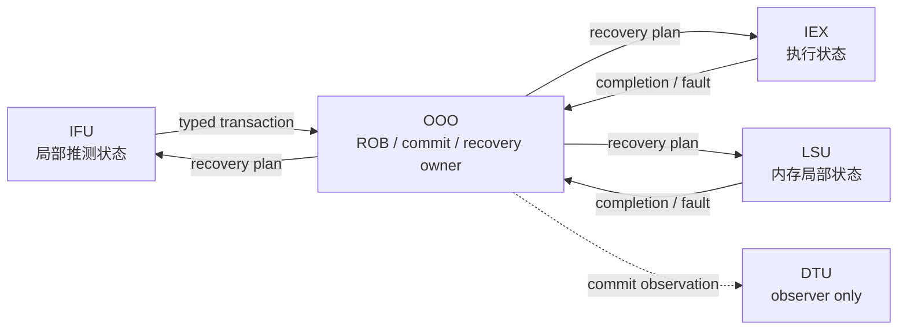
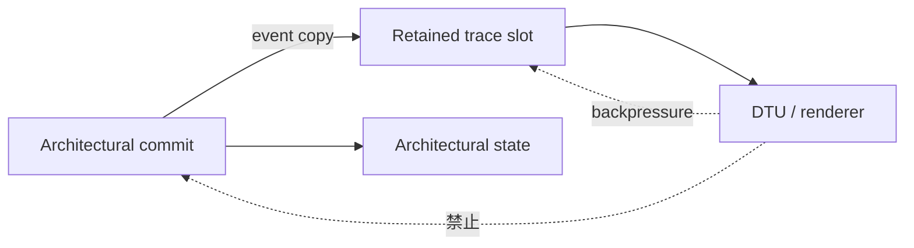
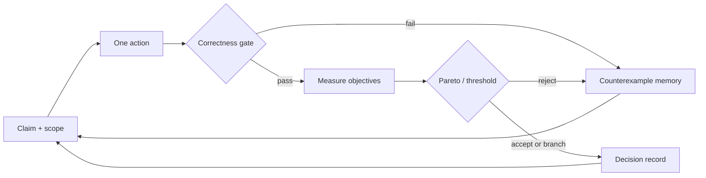

# 模块化把复杂核变成**可审计实验**

从 LinxCore 案例到软硬件 trace，再到 Agent 驱动的 Pareto 探索

  

    

      

        模块契约→
        跨层证据→
        受约束行动→
        决策记忆
      

    

    
第二课 · 60 分钟 · LinxCore 仅作模块化处理器案例

  

  

<!--
NDF-ID: NDF-LRN-201, NDF-LRN-202, NDF-SRC-003
Learning objective: 建立“模块契约—跨层证据—受约束行动—决策记忆”的第二课主线。
Duration: 1 min
Visual intent: class: hero；本地概念图承载开场氛围，四节点流程给出唯一叙事主线。
Evidence: docs/NDF.md; experiments/artifacts/summary.json
Interaction: 请听众记住一个问题：这个结论由谁裁决？
Caveat: LinxCore 是课程案例，不是 PTO 官方实现，也不定义 PTO 语义。
[Sources]
- docs/NDF.md
- materials/SOURCES.yaml
-->

---

# 第二课把闭环落到**一个模块、一条 trace、一个决策**

  
<h2>模块</h2>
谁拥有状态？ 接口何时传输？

  
<h2>Trace</h2>
软件与硬件 如何对齐？

  
<h2>决策</h2>
哪个候选 值得保留？

  15 min 模块→
  16.5 min 证据→
  23.5 min 探索→
  5 min 收束

<!--
NDF-ID: NDF-LRN-201, NDF-LRN-202
Learning objective: 说明本课三个可观察学习结果及其时间分配。
Duration: 1.5 min
Visual intent: class: architecture；三张责任卡与四段时间轴共同标定 60 分钟路线。
Evidence: docs/NDF.md
Interaction: 请听众选出自己当前最薄弱的一列，课末复核。
Caveat: 时间分配含现场互动，不代表三个研究阶段的真实工程成本。
[Sources]
- docs/NDF.md
- materials/agenda-2026.txt
-->

---

# 先钉死三条边界，才不会把**案例说成规范**

| 对象 | 本课中的角色 | 本课不声称 |
|---|---|---|
| PTO executable architecture spec | 固定版本的 PTO 规范事实源 | 不规定 LinxCore 微架构 |
| LinxCore | 模块化处理器与软硬件协同案例 | 不是 PTO 官方实现 |
| TAO | v0.1 物理设计研究提案 | 不是已验证产品或既成流程 |

  
规范事实≠案例事实≠研究提案

<!--
NDF-ID: NDF-SRC-001, NDF-SRC-003, NDF-MTH-003
Learning objective: 准确区分 PTO 规范事实、LinxCore 案例事实与 TAO v0.1 研究假设。
Duration: 1.5 min
Visual intent: class: compare；三行边界表与“不等于”关系防止概念混层。
Evidence: materials/SOURCES.yaml; docs/NDF.md
Interaction: 快问快答：“TAO 内环可秒级运行”应归为哪类主张？
Caveat: TAO 页只介绍提案中的可检验方向，不报告已取得的物理设计收益。
[Sources]
- materials/SOURCES.yaml
- materials/agentic_tao_physical_design_flow.md
- https://github.com/PTO-ISA/pto-spec/tree/9574f0293929bf692517dd29de11a8354440c7dc
-->

---

# 模块不是文件夹，而是**状态、接口和证据的责任单元**

  

    

      

        唯一状态所有者+
        类型化事务+
        局部不变量+
        替换证据
      

    

    
能单独说明、刺激、观察、否证，才是研究可用的边界。

  

  

<!--
NDF-ID: NDF-LRN-201, NDF-SRC-003
Learning objective: 用四个责任维度定义研究可用的模块，而非按源码目录定义模块。
Duration: 2 min
Visual intent: class: section；本地模块化处理器概念图配合四项模块责任。
Evidence: vendor/LinxCore/docs/spec/00-charter/scope.md
Interaction: 让听众用四项标准判断“TOP 目录”是否天然是一个模块。
Caveat: 四项标准是课程抽象；具体模块粒度仍受项目接口和验证成本约束。
[Sources]
- vendor/LinxCore/docs/spec/00-charter/scope.md
- vendor/LinxCore/docs/spec/10-architecture/ownership.md
-->

---

# LinxCore 案例显示执行路径可以按**责任边界**拆开

<LinxCoreModuleExplorer />

点击模块：先问“拥有哪类状态”，再问“输出哪种事务”。

<!--
NDF-ID: NDF-LRN-201, NDF-SRC-003
Learning objective: 沿 LinxCore 案例路径识别模块职责、状态归属与相邻事务。
Duration: 2.5 min
Visual intent: class: architecture；共享 LinxCoreModuleExplorer 提供逐模块点击、播放和复位。
Evidence: vendor/LinxCore/docs/spec/00-charter/scope.md; vendor/LinxCore/docs/spec/10-architecture/ownership.md
Interaction: 依次点击 Fetch、BISQ、BROB；每次只说一个状态责任和一个接口责任。
Caveat: 组件是教学概览，不能替代 LinxCore 当前源码、接口清单与稳定条款。
[Sources]
- https://github.com/LinxISA/LinxCore
- vendor/LinxCore/docs/spec/00-charter/scope.md
- vendor/LinxCore/docs/spec/10-architecture/ownership.md
-->

---

# 单一状态所有者让恢复与提交只有**一个裁决点**

> 多个模块可以报告事实，但不能同时拥有同一项架构裁决。

<!--
NDF-ID: NDF-LRN-201, NDF-MTH-002
Learning objective: 解释为何 ROB、顺序提交和全局恢复必须有唯一状态所有者。
Duration: 2 min
Visual intent: class: architecture；确定性 Mermaid 权限图显示报告边与裁决边不同。
Evidence: vendor/LinxCore/docs/spec/10-architecture/ownership.md
Interaction: 请听众指出若 DTU 也能阻塞 commit，会新增哪条危险控制边。
Caveat: 图省略 CTU、RENU 等细节，仅突出 ARC-TOP-020/022 的责任边界。
[Sources]
- vendor/LinxCore/docs/spec/10-architecture/ownership.md
- vendor/LinxCore/docs/spec/50-verification/contract-spine.md
-->

---

# ready/valid：一个**局部契约**就够了

<CircuitDataflow />

<!--
NDF-ID: NDF-LRN-201
Learning objective: 用 fire、稳定性和恰好一次传输定义队列接口不变量。
Duration: 2 min
Visual intent: class: circuit-focus；共享 CircuitDataflow 逐拍演示数据沿队列连接移动。
Evidence: experiments/artifacts/05/queue_trace.csv
Interaction: Play 后在任一阻塞拍暂停；指出哪些信号允许变化、哪些必须稳定。
Caveat: 组件展示通用 queue-wired 模型；实验 05 才是本课确定性队列证据。
[Sources]
- experiments/05_linxcore_queue/run.py
- vendor/LinxCore/docs/spec/20-behavior/ifu.md
-->

---

# 8 周期队列 trace 把“不会丢数据”变成**可重放证据**

| cycle | ready | before | push | pop | after |
|---:|:---:|---|---:|---:|---|
| 1 | false | `[3]` | 5 | — | `[3,5]` |
| 2 | false | `[3,5]` | — | — | `[3,5]` |
| 3 | true | `[3,5]` | 8 | 3 | `[5,8]` |
| 7 | true | `[13]` | — | 13 | `[]` |

  
sent [3,5,8,13]=received [3,5,8,13]+1 backpressure cycle

<!--
NDF-ID: NDF-LRN-201, NDF-MTH-003
Learning objective: 从 queue trace 复核保持、入队、出队与最终序列一致性。
Duration: 2.5 min
Visual intent: class: code-trace；真实 CSV 行与 summary 的发送/接收序列对齐。
Evidence: experiments/artifacts/05/queue_trace.csv; experiments/artifacts/05/queue_summary.json
Interaction: 请听众手算 cycle 3 的 queue_after，并解释同拍 push/pop 的顺序。
Caveat: `backpressure_cycles=1` 是实验脚本的统计口径；trace 中 consumer_ready=false 的拍数不等同于该指标。
[Sources]
- experiments/artifacts/05/queue_trace.csv
- experiments/artifacts/05/queue_summary.json
- experiments/05_linxcore_queue/run.py
-->

---

# 背压传播必须停在接口，不能污染**架构语义**

<TimingDiagram :cycles="8" />

时延可以变化；事务身份、顺序和值必须保持，架构结果才可比较。

<!--
NDF-ID: NDF-LRN-201, NDF-LRN-102
Learning objective: 区分允许变化的等待周期与必须保持的事务身份、顺序和值。
Duration: 2 min
Visual intent: class: code-trace；共享 TimingDiagram 用 valid、ready、fire 波形表现阻塞与唯一传输。
Evidence: experiments/artifacts/05/queue_trace.csv
Interaction: 让听众指出 ready=0 时若 payload 改变，会违反哪条局部不变量。
Caveat: 活性、公平性和最大等待时间需额外性质；仅靠安全性不变量不能证明。
[Sources]
- experiments/artifacts/05/queue_trace.csv
- vendor/LinxCore/docs/spec/20-behavior/ifu.md
-->

---

# 软硬件协同的共同语言是**可比较事件**，不是共享实现

  

    

      

        ELF 元数据→
        软件 trace↔
        硬件 trace→
        首个分歧
      

    

    
实现可以不同；身份、顺序和架构副作用必须进入同一比较域。

  

  

<!--
NDF-ID: NDF-LRN-201, NDF-LRN-102
Learning objective: 把软硬件协同理解为事件协议对齐，而非代码或内部周期对齐。
Duration: 2 min
Visual intent: class: section；本地软硬件实验概念图与四节点 crosscheck 管道进入证据章节。
Evidence: experiments/artifacts/06/crosscheck.json
Interaction: 请听众说出“软件模型与 RTL 必须相同”的一个错误比较维度。
Caveat: 软件参考模型也可能有缺陷，因此仍需固定版本、独立测试与多源证据。
[Sources]
- experiments/06_trace_crosscheck/README.md
- experiments/artifacts/06/crosscheck.json
-->

---

# 从 ELF 到提交 trace，每层只承诺**自己知道的事实**

| 层 | 可靠事实 | 不应越权推断 |
|---|---|---|
| ELF 元数据 | 入口地址、符号边界 | 动态提交顺序 |
| QEMU / 软件模型 | 指令语义与架构状态变换 | RTL 内部 stage 时序 |
| 硬件 commit trace | 实际提交事件与副作用 | 未暴露的内部因果 |

  
来源→字段 schema→允许的主张

<!--
NDF-ID: NDF-LRN-201, NDF-MTH-003
Learning objective: 为 ELF、软件参考 trace 与硬件提交 trace 分配不重叠的证据责任。
Duration: 1.5 min
Visual intent: class: evidence；三层事实表限制每个来源能支持的主张范围。
Evidence: experiments/06_trace_crosscheck/fixtures/elf_symbols.json; experiments/06_trace_crosscheck/fixtures/qemu_trace.csv; experiments/06_trace_crosscheck/fixtures/hardware_trace.csv
Interaction: 快问快答：入口 PC 匹配能否证明所有指令语义匹配？
Caveat: 本课 fixture 是最小教学输入，不代表完整 QEMU 或硅后验证覆盖。
[Sources]
- experiments/06_trace_crosscheck/README.md
- experiments/06_trace_crosscheck/run.py
-->

---

# Crosscheck 先固定输入身份，再比较**4 条提交事件**

| instruction | PC | opcode | rd | value | matched |
|---:|---|---|---|---:|:---:|
| 0 | `0x80000000` | movi | r1 | 2 | ✓ |
| 1 | `0x80000004` | movi | r2 | 5 | ✓ |
| 2 | `0x80000008` | add | r3 | 7 | ✓ |
| 3 | `0x8000000c` | halt | — | — | ✓ |

  
ELF entry = first PC∧mismatches = []⇒本 fixture 通过

<!--
NDF-ID: NDF-LRN-201, NDF-LRN-102
Learning objective: 读取实验 06 的归一化结果，并把“通过”限定在固定 fixture 与 4 条指令上。
Duration: 2.5 min
Visual intent: class: code-trace；直接呈现 normalized_trace.csv 的四条真实事件与 crosscheck 判定。
Evidence: experiments/artifacts/06/normalized_trace.csv; experiments/artifacts/06/crosscheck.json
Interaction: 让听众逐列说出 opcode、rd、value 中哪一项变化会构成首个架构分歧。
Caveat: 4/4 匹配只证明该 fixture；不能外推为整个 ISA、整个核或所有异常路径正确。
[Sources]
- experiments/artifacts/06/normalized_trace.csv
- experiments/artifacts/06/crosscheck.json
- experiments/06_trace_crosscheck/run.py
-->

---

# Trace 不一致要先定位**首个分歧**，不要先解释全局

<TraceComparator />

<!--
NDF-ID: NDF-LRN-102, NDF-MTH-003
Learning objective: 执行标准化、身份对齐、首个分歧定位和反例最小化的调试顺序。
Duration: 2 min
Visual intent: class: code-trace；共享 TraceComparator 用教学反例高亮 cycle 107 的地址生成分歧。
Evidence: experiments/artifacts/06/crosscheck.json; components/TraceComparator.vue
Interaction: Step 到 cycle 107，再打开 mismatches only；只描述首个可观察差异。
Caveat: 组件内 cycle 107 不匹配是教学反例；实验 06 的真实 fixture 为 4/4 匹配、无 mismatch。
[Sources]
- components/TraceComparator.vue
- experiments/artifacts/06/crosscheck.json
- vendor/LinxCore/docs/trace/linxtrace_v1.md
-->

---

# 稳定 UID 让乱序、重放和 flush 之后仍能**可靠对齐**

  

    <code>uop_uid</code> 动态微操作
    <code>seq</code> 架构提交次序
    <code>block_uid</code> 动态块
    <code>uop_parent_uid</code> 重放 / 展开谱系
    →可靠对齐
  

| 情况 | 身份规则 |
|---|---|
| replay | 新 `uop_uid`，保留 `uop_parent_uid` |
| flushed/trapped | 可有 `uop_uid`，但没有提交 `seq` |
| block | `block_uid` 关联同一动态块生命周期 |

<!--
NDF-ID: NDF-LRN-102
Learning objective: 区分 uop_uid、seq、block_uid 与 uop_parent_uid 在 trace 对齐中的职责。
Duration: 2.5 min
Visual intent: class: architecture；身份汇聚图与三行边界表说明身份不是 PC 的同义词。
Evidence: vendor/LinxCore/docs/trace/uid_contract.md
Interaction: 给出 replay 场景，让听众判断旧、新 uop 是否应共享同一 uid。
Caveat: 这些字段是 LinxCore trace 案例合同，不是 PTO 规范字段。
[Sources]
- vendor/LinxCore/docs/trace/uid_contract.md
- vendor/LinxCore/docs/trace/linxtrace_v1.md
-->

---

# 观察者不能反向阻塞**被观察系统**

  
<h2>允许</h2>
阻塞一个 retained trace packet；必要时丢弃后续观察。

  
<h2>禁止</h2>
trace ready 反向决定 fetch、transfer 或 commit。

<!--
NDF-ID: NDF-LRN-201, NDF-MTH-002
Learning objective: 解释非阻塞 trace 如何隔离观察通道和架构进展。
Duration: 2 min
Visual intent: class: architecture；虚线 backpressure 明确终止于 retained trace slot。
Evidence: vendor/LinxCore/docs/spec/20-behavior/ifu.md
Interaction: 请听众指出 trace 丢包与阻塞 commit 两种策略各自影响的主张类型。
Caveat: 非阻塞观察可能丢失事件；必须显式记录 drop 语义和覆盖限制。
[Sources]
- vendor/LinxCore/docs/spec/20-behavior/ifu.md
- vendor/LinxCore/docs/spec/10-architecture/ownership.md
-->

---

# 正确性门必须在 PPA 测量之前**关闭错误分支**

  

    候选动作→
    编译 / elaboration→
    等价 / 不变量门→
    PPA 测量→
    决策写回
  

  <blockquote><strong>Gate fail：</strong>保存反例，不进入性能比较。</blockquote>
  <blockquote><strong>Gate pass：</strong>才允许生成候选指标。</blockquote>

<!--
NDF-ID: NDF-MTH-001, NDF-MTH-002, NDF-LRN-202
Learning objective: 设计“正确性先于性能”的不可绕过门控顺序。
Duration: 2 min
Visual intent: class: experiment；单向门控流程阻止错误候选污染 PPA 数据集。
Evidence: experiments/artifacts/summary.json
Interaction: 给出“IPC +20%，trace 不匹配”，全班做 Reject 手势。
Caveat: 通过功能门不等于通过活性、时序、功耗或物理签核门。
[Sources]
- materials/agentic_circuit_optimizer.md
- docs/NDF.md
- experiments/artifacts/summary.json
-->

---

# 故意越界并得到 exit 2，证明裁判会**拒绝候选**

  

    <h2>输入</h2>
    
allocated = 16 B

    
requested = 20 B

  

  

    <h2>预期证据</h2>
    
exit code = 2

    
<code>expected_failure_observed = true</code>

  

触发指定不变量→得到指定错误→红灯测试通过

<!--
NDF-ID: NDF-MTH-002, NDF-LRN-202
Learning objective: 用预期退出码、错误条件与结构化工件定义 intentional failure 的成功。
Duration: 2 min
Visual intent: class: experiment；左右卡片直接比较输入越界与预期裁判结果。
Evidence: experiments/artifacts/07/expected_failure.json
Interaction: 揭示右栏前，让听众先写下应观察到的退出码和失败原因。
Caveat: 任意非零退出都不算成功；必须命中指定越界不变量和预期退出码。
[Sources]
- experiments/07_intentional_failure/run.py
- experiments/artifacts/07/expected_failure.json
-->

---

# 失败工件是**设计知识**，不是日志垃圾

| 应保存 | 作用 |
|---|---|
| 最小触发输入 | 复现与 delta-debugging |
| 首个架构分歧 | 限定因果搜索范围 |
| 候选 diff 与配置 | 归因到唯一动作 |
| 退出码、stderr、结构化 JSON | 让机器可判定 |
| 对应 NDF / 决策 ID | 防止下一轮重复犯错 |

  
失败→最小反例→负向约束→下一轮更小的搜索空间

<!--
NDF-ID: NDF-MTH-002, NDF-MTH-003, NDF-LRN-202
Learning objective: 把失败实验转换为可复现反例、负向约束与下一轮搜索记忆。
Duration: 2 min
Visual intent: class: evidence；五类失败工件表与“搜索空间收缩”流程相连。
Evidence: experiments/artifacts/07/expected_failure.json
Interaction: 请听众指出只保存截图而不保存输入时，哪一步无法重放。
Caveat: 失败记忆也会过时；参考版本或不变量变化后必须重新验证。
[Sources]
- materials/agentic_circuit_optimizer.md
- experiments/artifacts/07/expected_failure.json
- docs/NDF.md
-->

---

# 体系结构 Agent 由**五项可审计合同**组成

  

    

      

        动作×
        传感器×
        裁判×
        记忆×
        接受规则
      

    

    
Prompt 只表达意图；五项合同决定 Agent 能做什么、相信什么、何时停手。

  

  

<!--
NDF-ID: NDF-LRN-202, NDF-MTH-002
Learning objective: 定义体系结构优化 Agent 的动作、传感器、裁判、记忆和接受规则。
Duration: 2 min
Visual intent: class: section；本地 Agent 闭环概念图与五项乘积关系强调缺一不可。
Evidence: docs/NDF.md; materials/agentic_circuit_optimizer.md
Interaction: 让听众为“调整队列深度”各说出五项合同中的一个字段。
Caveat: 合同边界不能保证模型推理正确，但能限制副作用并暴露错误。
[Sources]
- docs/NDF.md
- materials/agentic_circuit_optimizer.md
-->

---

# 动作空间越结构化，实验的**因果归因**越可信

| 动作 | 保持不变 | 主要风险 |
|---|---|---|
| 改 queue depth | transaction schema、顺序 | 活性、面积 |
| 移 pipeline boundary | 架构观察结果 | bypass、stall |
| 改 issue width | 提交语义 | 端口、相关性 |
| 复制 / 共享 FU | opcode 结果与异常 | 争用、时序 |

  
参数化动作→最小 diff→单一假设→可解释结果

<!--
NDF-ID: NDF-LRN-202, NDF-LRN-201
Learning objective: 把自由代码编辑收缩为带不变量与风险标签的结构化微架构动作。
Duration: 1.5 min
Visual intent: class: compare；四类动作表与归因链说明动作不是无边界 patch。
Evidence: materials/agentic_circuit_optimizer.md
Interaction: 让听众把“让核更快”改写为表中的一个动作和一个保持项。
Caveat: 结构性跳变不能伪装成参数微调；应新建 NDF 分支和对照基线。
[Sources]
- materials/agentic_circuit_optimizer.md
- https://github.com/LinxISA/pyCircuit
-->

---

# 旋钮只有绑定不变量后，才是**研究变量**

<DesignSpaceExplorer />

<!--
NDF-ID: NDF-LRN-202
Learning objective: 为发射宽度、ROB、向量 lane 与频率旋钮同时指定合法域和正确性不变量。
Duration: 2 min
Visual intent: class: circuit-focus；共享 DesignSpaceExplorer 让听众观察旋钮与代理指标联动。
Evidence: components/DesignSpaceExplorer.vue; experiments/artifacts/08/design_points.csv
Interaction: 切换 Efficient 与 Performance；要求先说不变量，再读指标。
Caveat: 组件数值是确定性教学启发式，不是 LinxCore 实测 PPA，也不来自实验 08 的真实表。
[Sources]
- components/DesignSpaceExplorer.vue
- materials/agentic_circuit_optimizer.md
- experiments/artifacts/08/design_points.csv
-->

---

# 代理指标适合**筛选**，不适合宣称真实 PPA

| 层级 | 适合回答 | 不适合回答 |
|---|---|---|
| 代理模型 | 哪些点值得继续 | 最终 PPA 结论 |
| 真实工具 | 固定条件下的 QoR | 所有工作负载与工艺外推 |

<!--
NDF-ID: NDF-LRN-202, NDF-MTH-003
Learning objective: 区分快速代理筛选与真实综合、仿真、物理实现测量的证据强度。
Duration: 1.5 min
Visual intent: class: architecture；代理—真实工具—校准闭环防止把启发式数字冒充实测。
Evidence: materials/agentic_circuit_optimizer.md; materials/agentic_tao_physical_design_flow.md
Interaction: 请听众判断上一页 efficiency score 能否进入论文 PPA 主表。
Caveat: 即使真实工具也只支持固定版本、配置、工艺与工作负载范围内的观察。
[Sources]
- materials/agentic_circuit_optimizer.md
- materials/agentic_tao_physical_design_flow.md
-->

---

# Pareto 前沿保留**不可比较的好设计**

<ParetoFrontier />

<!--
NDF-ID: NDF-LRN-202
Learning objective: 解释非支配关系，并保留高性能高成本与低性能低成本的不可比较候选。
Duration: 2.5 min
Visual intent: class: section；本地设计空间概念图衬底上使用共享 ParetoFrontier 逐点揭示前沿。
Evidence: experiments/artifacts/08/pareto_frontier.json; components/ParetoFrontier.vue
Interaction: Step 揭示全部点，再点 Highlight；让听众解释为何前沿不等于单一赢家。
Caveat: 组件坐标是教学数据；实验 08 另用 latency、energy、area 三个最小化目标。
[Sources]
- components/ParetoFrontier.vue
- experiments/artifacts/08/pareto_frontier.json
- materials/agentic_circuit_optimizer.md
-->

---

# 被支配点仍能解释搜索为什么**停止**

| design | latency ↓ | energy ↓ | area ↓ | Pareto |
|---|---:|---:|---:|:---:|
| tiny | 20 | 6 | 2 | ✓ |
| eco | 14 | 5 | 3 | ✓ |
| balanced | 10 | 7 | 4 | ✓ |
| fast | 7 | 10 | 6 | ✓ |
| wasteful | 16 | 9 | 5 | ✗ |
| oversized | 10 | 9 | 7 | ✗ |

  
balanced支配oversized因为同延迟、更低能耗、更小面积

<!--
NDF-ID: NDF-LRN-202, NDF-MTH-003
Learning objective: 用实验 08 的三个最小化目标手工证明一个候选被支配。
Duration: 2.5 min
Visual intent: class: evidence；真实 design_points.csv 表与 balanced→oversized 支配证明对齐。
Evidence: experiments/artifacts/08/design_points.csv; experiments/artifacts/08/pareto_frontier.json
Interaction: 先遮住 Pareto 列，让听众找出 wasteful 和 oversized 的支配者。
Caveat: 表中指标是微型确定性实验数据，不是 LinxCore 实测 PPA。
[Sources]
- experiments/artifacts/08/design_points.csv
- experiments/artifacts/08/pareto_frontier.json
- experiments/08_design_space_pareto/run.py
-->

---

# 接受规则必须同时约束**正确性、收益和可解释性**

  

    正确：硬门全过∧
    有益：非支配或过阈值∧
    可解释：动作与差异可归因=
    ACCEPT
  

| 决策 | 条件 |
|---|---|
| Reject | 任一硬约束失败 |
| Continue | 正确，但收益或证据尚不足 |
| Accept | 三项合取成立并写回决策记录 |

<!--
NDF-ID: NDF-LRN-202, NDF-MTH-001, NDF-MTH-002
Learning objective: 为 Agent 候选定义 Reject、Continue 与 Accept 三态规则。
Duration: 2 min
Visual intent: class: evidence；三项合取门和决策表共同防止“只看一个分数”。
Evidence: experiments/artifacts/07/expected_failure.json; experiments/artifacts/08/design_points.csv
Interaction: 对“trace 通过、延迟下降、能耗与面积上升”做三态投票并说明阈值缺口。
Caveat: 多目标权衡没有脱离约束和使用场景的全局最优点。
[Sources]
- docs/NDF.md
- materials/agentic_circuit_optimizer.md
- experiments/artifacts/08/design_points.csv
-->

---

# 每轮只验证一个假设，结果才能写回**设计记忆**

  
一轮一动作+正负结果都保存+下一轮只读已验证记忆

<!--
NDF-ID: NDF-MTH-001, NDF-LRN-202
Learning objective: 构造单假设、双出口、正负结果都写回的 Agent 优化循环。
Duration: 2 min
Visual intent: class: experiment；Mermaid 闭环把失败反例和接受记录都反馈到下一轮。
Evidence: experiments/artifacts/summary.json; materials/agentic_circuit_optimizer.md
Interaction: 让听众指出若一轮同时改 width 与 queue depth，哪个箭头失去可解释性。
Caveat: 因子实验可同时改变多个变量，但必须预先设计交互项与归因模型。
[Sources]
- materials/agentic_circuit_optimizer.md
- experiments/artifacts/summary.json
- docs/NDF.md
-->

---

# 结构性跳变应开新分支，而不是伪装成**局部优化**

  

    <h2>内环动作</h2>
    
队列深度、流水边界、FU 配比、频率目标

    
同一合同下枚举

  

  

    <h2>结构提案</h2>
    
新前端、超标量化、新预测器、跨层物理划分

    
新 NDF 分支 + 新对照

  

搜索空间定义权≠空间内枚举权

<!--
NDF-ID: NDF-LRN-202, NDF-LRN-101
Learning objective: 区分合同内参数优化与需要新 NDF 分支的结构性跳变。
Duration: 1.5 min
Visual intent: class: compare；双栏对比内环动作与外层结构提案的不同治理方式。
Evidence: materials/agentic_circuit_optimizer.md
Interaction: 判断“从单发射改为双发射”应进入哪一栏，并说明为何。
Caveat: 分界取决于既有合同；若接口与状态所有权变化，就不能当作普通旋钮。
[Sources]
- materials/agentic_circuit_optimizer.md
- docs/NDF.md
-->

---

# TAO v0.1 只是一条**待验证的物理设计研究路线**

  

    

      

        前端候选→
        物理动作→
        LEC + 签核→
        校准
      

    

    
可检验主张：分层内环能否更快探索，同时由外环真实工具校准偏差。

  

  

<!--
NDF-ID: NDF-LRN-202, NDF-MTH-003
Learning objective: 把 TAO v0.1 表述为可否证的代理—签核分层研究提案。
Duration: 2.5 min
Visual intent: class: section；本地 frontier 概念图配合前端—物理动作—签核—校准链。
Evidence: materials/agentic_tao_physical_design_flow.md; materials/SOURCES.yaml
Interaction: 让听众为“内环更快”补一个真实工具校准指标和停止条件。
Caveat: TAO 文档状态为 research-proposal-v0.1；本课不宣称已实现、已签核或已取得 PPA 收益。
[Sources]
- materials/agentic_tao_physical_design_flow.md
- materials/SOURCES.yaml
-->

---

# 练习：用证据卡审计一个“更快”的候选

  

    <h2>候选</h2>
    
queue depth：2 → 4

    
代理 latency：10 → 8

    
一份 commit trace

  

  

    <h2>两人产出</h2>
    <ol>
      <li>一个架构不变量</li>
      <li>一个 crosscheck 对齐键</li>
      <li>一个 intentional failure</li>
      <li>Reject / Continue / Accept 条件</li>
    </ol>
  

90 秒设计→30 秒交换反证

<!--
NDF-ID: NDF-LRN-201, NDF-LRN-202
Learning objective: 综合模块不变量、trace 对齐、失败实验和接受规则审计候选设计。
Duration: 1.5 min
Visual intent: class: quiz；候选输入与四项交付物并排，内置 90+30 秒计时。
Evidence: experiments/artifacts/05/queue_summary.json; experiments/artifacts/06/crosscheck.json; experiments/artifacts/07/expected_failure.json
Interaction: 两人一组完成证据卡；交换后只能提出一个能推翻主张的反例。
Caveat: 代理 latency 仅用于练习，不构成真实 LinxCore 性能结果。
[Sources]
- experiments/artifacts/05/queue_summary.json
- experiments/artifacts/06/crosscheck.json
- experiments/artifacts/07/expected_failure.json
-->

---

# 一张决策记录应让下一位研究者**复现选择**

| 字段 | 本例内容 |
|---|---|
| Claim / Scope | depth 4 在固定输入下减少代理 latency |
| Action | 仅修改 queue depth 2→4 |
| Oracle | UID 对齐的 commit trace + queue invariant |
| Evidence | 配置、命令、JSON/CSV、退出码、工具版本 |
| Decision | Accept / Reject / Continue + 理由 |
| Revisit | 真实综合或 workload 改变时重测 |

  
主张→行动→证据→裁决→重访条件

<!--
NDF-ID: NDF-LRN-202, NDF-MTH-003
Learning objective: 编写包含主张、动作、裁判、证据、决策和重访条件的可重放记录。
Duration: 2 min
Visual intent: class: evidence；六字段决策表与线性追踪链给出可直接复用模板。
Evidence: docs/NDF.md; experiments/artifacts/summary.json
Interaction: 邀请一组用 20 秒读出自己的完整记录，另一组只检查缺失字段。
Caveat: 文件存在不等于证据有效；仍需校验生成命令、schema、版本和内容哈希。
[Sources]
- docs/NDF.md
- materials/agentic_circuit_optimizer.md
- experiments/artifacts/summary.json
-->

---

# 研究闭环的产物不是赢家，而是**可否证的决策历史**

  

    

      

        模块合同→
        crosscheck→
        失败反例→
        Pareto 档案→
        决策写回
      

    

    
<strong>带走一句话：</strong>让 Agent 扩展探索，让合同、trace 和独立裁判决定什么值得相信。

  

  

<!--
NDF-ID: NDF-LRN-201, NDF-LRN-202, NDF-MTH-001, NDF-MTH-002, NDF-SRC-003
Learning objective: 汇总模块设计、crosscheck、失败证据与 Pareto 探索的完整研究闭环。
Duration: 1 min
Visual intent: class: takeaway；本地证据章节图与五节点终局闭环回收全课。
Evidence: experiments/artifacts/summary.json; docs/NDF.md
Interaction: 回看第 2 页选择的薄弱列；用一句话说出现在可执行的下一步。
Caveat: LinxCore 始终只是案例；TAO 始终是 v0.1 研究提案；PTO 规范事实只来自固定版本规范源。
[Sources]
- docs/NDF.md
- materials/SOURCES.yaml
- experiments/artifacts/summary.json
-->
